## Classes and Objects
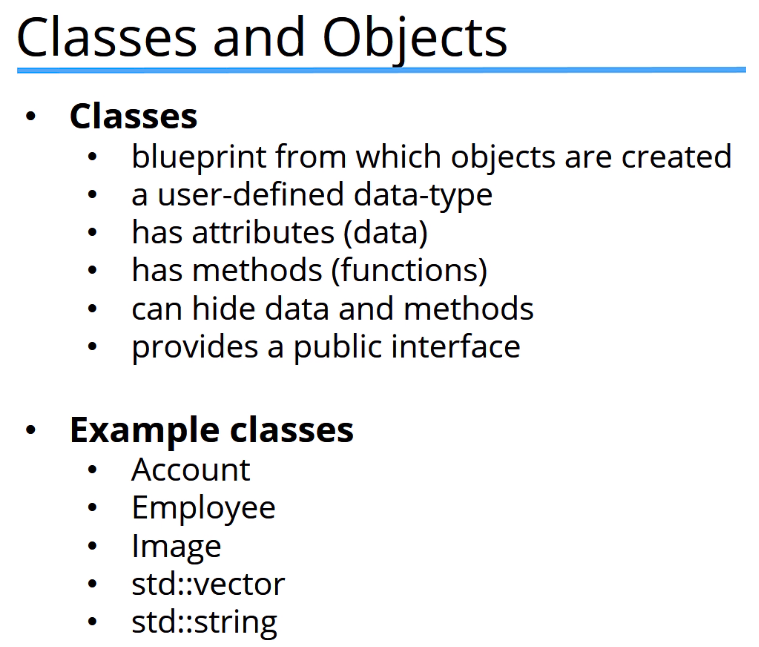

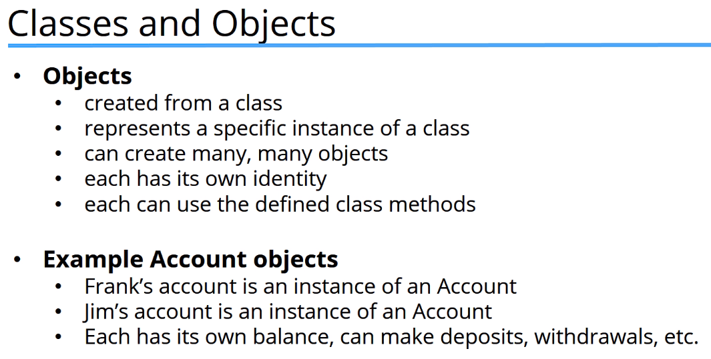

 

## Declaring a Class, Creating Objects
### `new [className()]`, returns a memory address to the object
### Use `new` the object should remain in memory until you manually `delete` it. If you don't use `new`, then the object will be destroyed when it goes out of scope.

### Because `new` objects are created on the heap and will need to be freed, otherwise it's created on the stack where it's popped off automatically

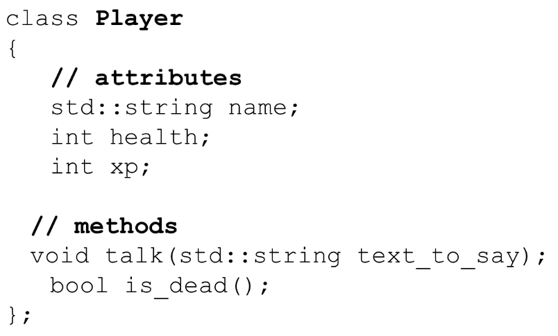

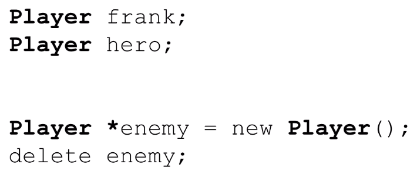

 

## Access Class members
### 2 ways:
- ### Dot notation
- ### Arrow notation
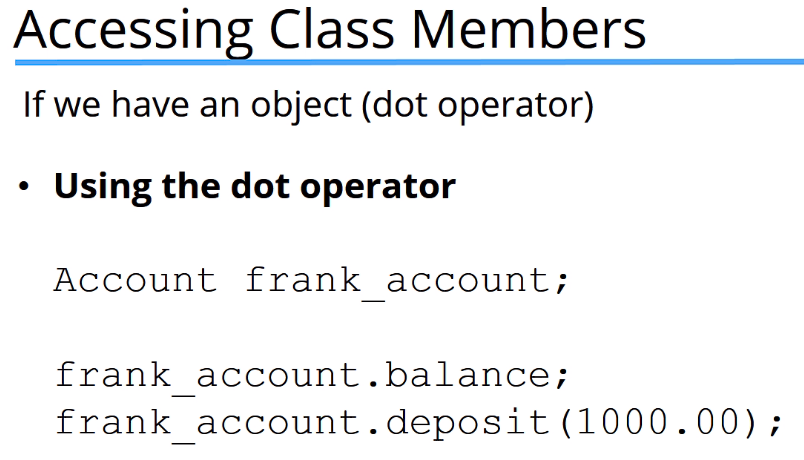

### If we have a pointer to an object, we have to dereference the pointer first (with parenthesis) then use dot notation, or just use arrow notation
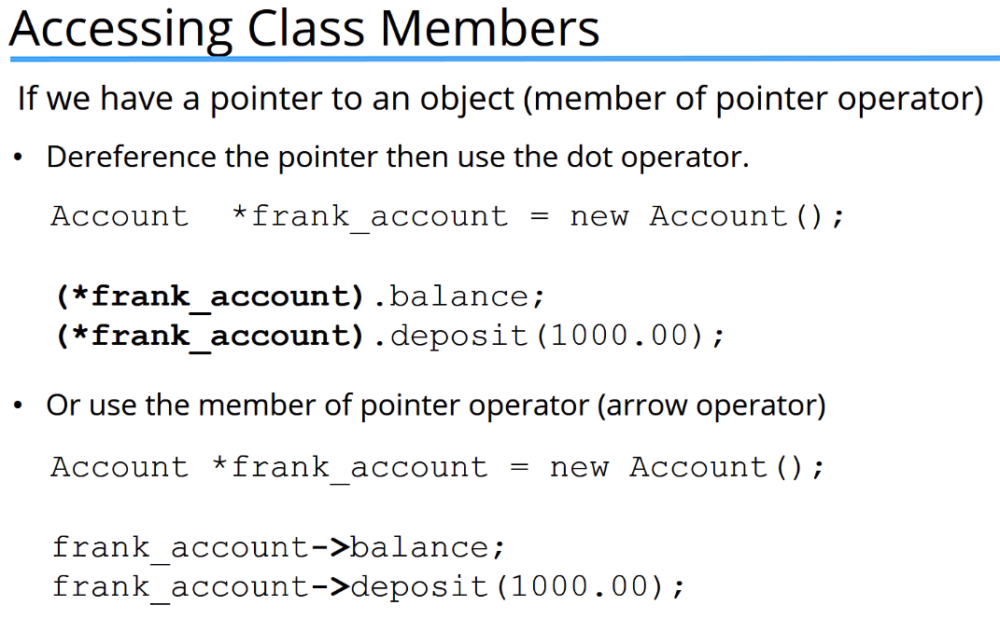

 

## Access Modifiers: `public`, `private`, `protected`
### `public` - accessible everywhere
### `private` - accessible only by members or friends of the class
### `protected` - accessible only by members, friends, or children of the class

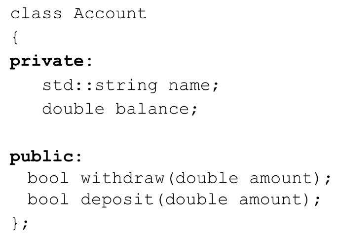

 

## Class methods
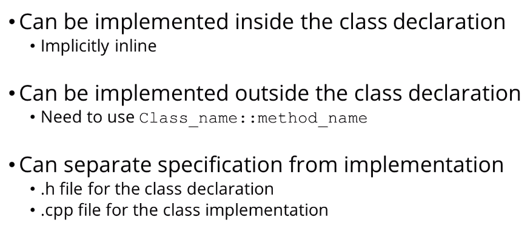

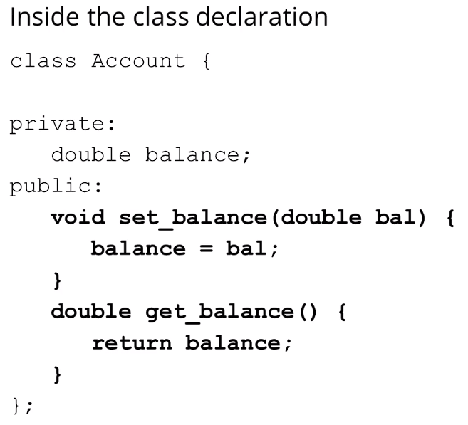

### Outside the class declaration...
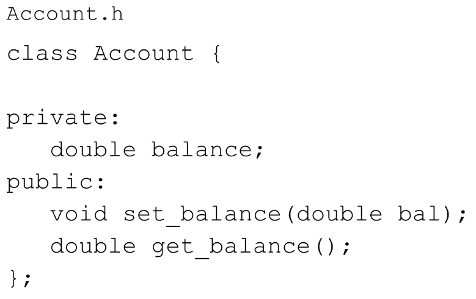

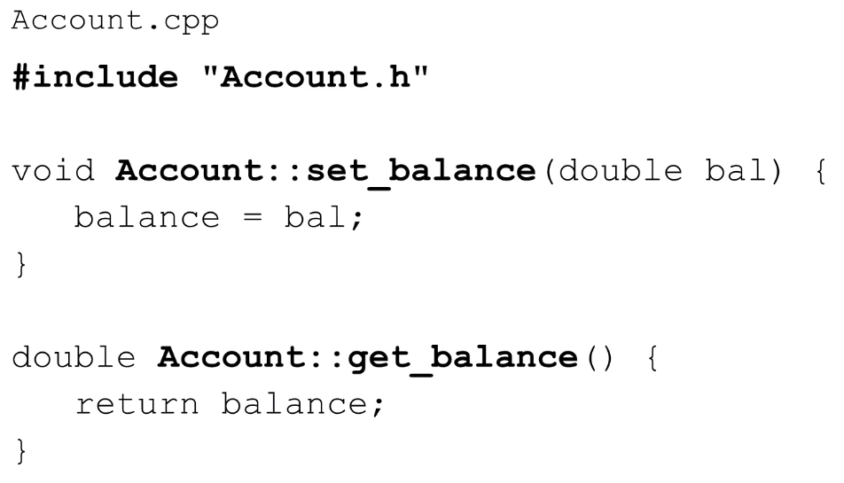

### ^ `#include` with double quotes tells the compiler to look in local project; when angle brackets are used `<>`, tells the compiler to look in the standard library

### Scope resolution operator required `::`

### To use a class in another file, must `#include` the header `.h` file, not `.cpp` file

 

## Include guard
### Can also use `#pragma once`
### Guarantees that a header file is only included once in the program
### Checks if the header file is already defined, if not, define it and include the header file
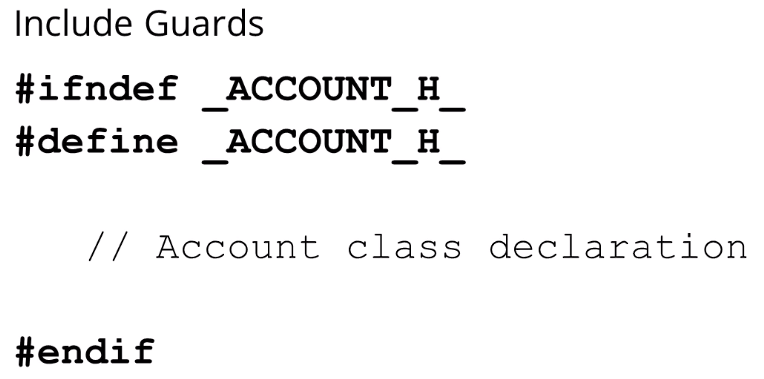