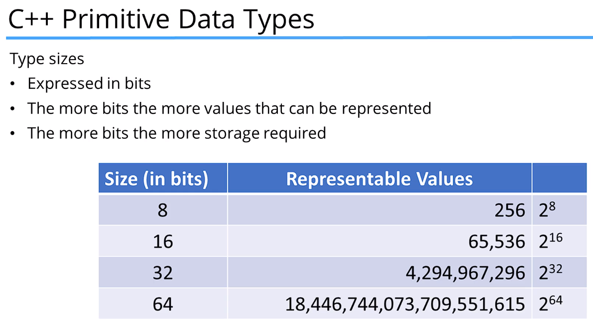
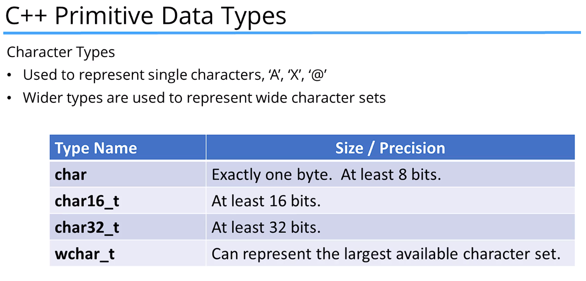
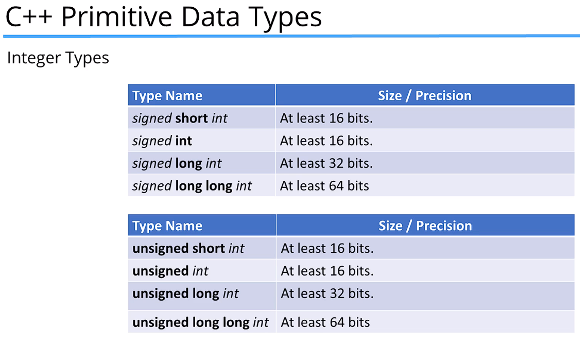
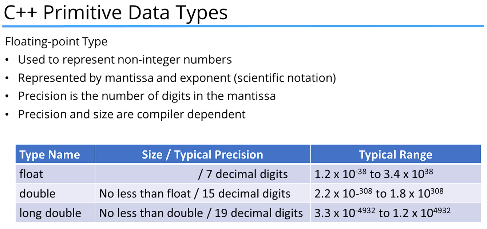
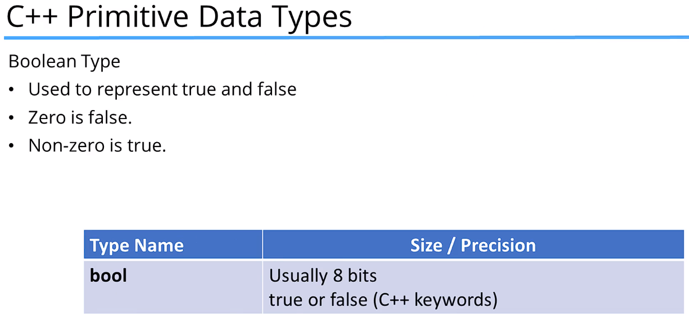

## Build Process
### 1) Compiling (higher level human readable code to lower level machine code)
### 2) Linking with external libraries
### 3) Create an executable file

 

### When files are compiled, object files are created for those files. These object files are then linked together to create the executable file.

### Linker errors occur when there is a library or object file missing, that's being referenced

### Runtime errors occur when the program is running

 

## Rebuild = Clean, then build
### Compile everything from scratch; default compiler behavior is to compile only changed files

 

## Debug vs Release Configuration
### Debug Configuration contains object files that contain debugging information; Relase Configuration contains object files that are optimized for size and speed.

 

## Preprocessor Directives
### Processes code before compilation; begin with '#'
### e.g.
- ### '#include <iostream>' is a Preprocessor Directive. When the preprocessor sees this, it will replace this line with the file that it's referring to

 

## 'int main()' Function
### Entry point of the program; must be defined in every C++ program; Only one main function per program
### Another version of main function is 'int main(int argc, char* argv[])' that expects arguments from the OS, from the commandline

 

## Namespaces
### Used to prevent naming conflicts
### e.g. Using entire namespace
- ### 'using namespace std'

 

### e.g. Using only what you need
- ### 'using std::cout'

 

### e.g. Using different namespaces
- ### 'std::cout', 'customLibraryNamespace::cout'

 

## Primitive Types
- ### 1 byte === 8 bits
| 128 | 64 | 32 | 16 | 8 | 4 | 2 | 1 |
| --- | --- | --- | --- | --- | --- | --- | --- |
| 2^7 | 2^6 | 2^5 | 2^4 | 2^3 | 2^2 | 2^1 | 2^0 |
- ### Max value of 8 bits is 255, max number of combinations is 256 (includes 0)

 

 

### By default integers are ***Signed*** (can be positive or negative)
- ### If this signed leftmost bit is 0, the number is positive or zero; if it is 1, the number is negative
### ***Unsigned*** integers can only be positive

 

 

 

## Constants
### Constants are immutable after they are declared and initialized

 

### Types of Constants
- ### Literal Constants (specific values... 3.14)
- ### Declared Constants (const)
- ### Constant expressions (constexpr)
- ### Enumerated constants (enum)
- ### Defined constants (#define)

 

