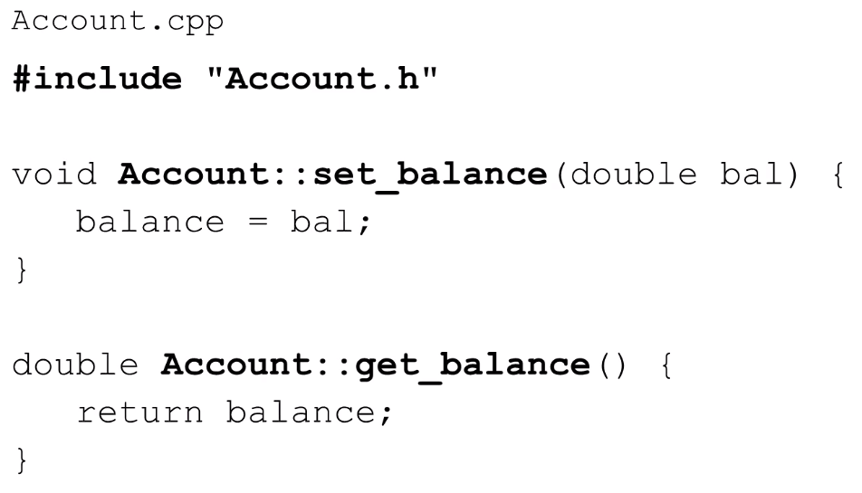
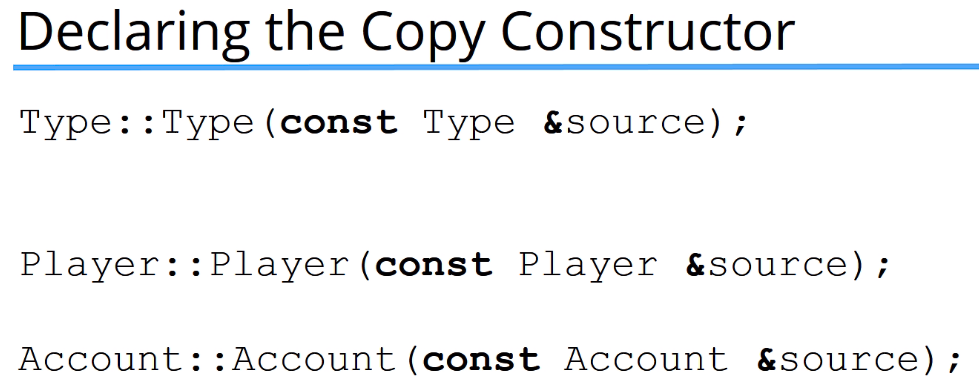

## Classes and Objects


<br>

## Declaring a Class, Creating Objects
### `new [className()]`, Returns a memory address to the object; allocated memory on the heap
```
e.g.
Player *enemy = new Player();
enemy->set_name("Random Enemy");
```
### Use `new` when the object should remain in memory until you manually `delete` it. If you don't use `new`, the object is created on the stack where it's popped off automatically (and memory freed) when it goes out of scope.

```
e.g.
// Popped off the stack when it goes out of scope
Player enemy {"Random Enemy"};
```

### `new` objects are created on the heap and MUST be freed, otherwise it will cause a memory leak, where you'll eventually run out of memory on the heap causing a crash


<br>

## Access Class members
### 2 ways:
- ### Dot notation
- ### Arrow notation


### If we have a pointer to an object, we have to dereference the pointer first (with parenthesis) then use dot notation, or just use arrow notation


<br>

## Access Modifiers: `public`, `private`, `protected`
### `public` - accessible everywhere
### `private` - accessible only by members or friends of the class; can't access on the object instance
### `protected` - accessible only by members, friends, or children of the class; can't access on the object instance


<br>

## Class methods


### Outside the class declaration...




### ^ `#include` with double quotes tells the compiler to look in local project; when angle brackets are used `<>`, tells the compiler to look in the standard library

### Scope resolution operator required `::`

### To use a class in another file, must `#include` the header `.h` file, not `.cpp` file

<br>

## Include guard
### Can also use `#pragma once`
### Guarantees that a header file is only included once in the program
### Checks if the header file is already defined, if not, define it and include the header file


<br>

## Constructors and Destructors
### A default constructor is called if the class has no constructor defined


<br>

## Constructor Initialization Lists


<br>

## Delegate Constructors
### A constructor calls another constructor in the same class (often during initialization lists)


<br>

## Copy Constructors (Lecture 147)
### Where are Copy Constructors needed?


<br>

### C++ provides a default copy constructor if you don't define one


<br>

### Declare and implement a copy constructor
- ### `const` is used as we don't want to modify the source object
- ### `&` (by-reference) is used to prevent the copy constructor from being called recursively an infinite amount of times
- ### Always a single object defined in the parameters



<br>

### Shallow Copy vs Deep Copy
- ### Shallow Copy (default behaviour of copy constructor)
	- ### Copied object points to the same memory address as the source object (on heap)
	- ### ***PROBLEM***: When the target object is destroyed because it goes out of scope (function call ends), it's destructor is called and the memory it uses is released. Since the source and target objects point to the same memory address, the source object will now point to invalid storage. When the destructor of the source object is called, it will try to release memory that's invalid, and will crash


<br>

- ### Deep Copy
	- ### Copied object will have a pointer to a different memory address than the source object; Create a copy of the data pointed to
	- ### Must Deep copy when you have a raw pointer as a class member


<br>

## Move Constructors
### Used to prevent copying of temporary r-values in copy constructors
### Moves an object on the heap rather than copying it


### In the context of **Move Semantics**, the R-Values are temporary objects that are created by the compiler
### R-Value reference operator `&&` = reference to the unnamed temporary R-value


<br>

### **Example**:
### Class defined with prototypes and a `int` pointer member


### - In our example, the Copy constructor definition makes a deep copy


### - Below, `Move{10}` and `Move{20}` are creating unnamed temporary objects (so they're R-Values), then we're passing them into a function, so the compiler will use copy constructors to make copies of the temporary objects

### - Inefficient because the copy constructor will make copies of all temporary objects


### Move constructor will now be called when an R-value is passed into the constructor


### Copy the address from the source to the target object, then `nullptr` the source pointer


<br>

## `This`


<br>

## Using `const` with Classes


### We have to declare class methods as `const` (using `const` after the method declaration) to tell the compiler that they are allowed to be called from a `const` object (even if the method doesn't modify the object)


<br>

## Static Class members
### Access attributes and methods without creating an instance of the class/an object

### Accessing static members using the class name then the scope resolution operator `::`

### E.g.
```
Player::get_num_players();
Player::num_players;
```

### If the static attribute is private, then it will only be accessible from a member or friend. However, C++ allows us to initialize the private static attribute from outside the class

<br>

## Structs vs Classes
### Everything you can do with classes, you can do with structs
### ***1 difference*** - Members are public by default in a struct, private by default in a class


<br>

## Friends of a Class


### `display_player` function has access to everything in the `Player` class


<br>

## Overloading Operators
### - Allows us to define how operators interact with our custom defined types
### - Cannot overload the following operators:
- ### `::`
- ### `.*`
- ### `.`
- ### `:?`
- ### `sizeof`


### Overloading the assignment operator (Copy)


### where `Mystring` class is defined as...


### `operator=`
- ### means you want to overload the assignment operator, `=` 


### `this`
- ### refers to the left hand side of the assignment operator

### `rhs`
- ### refers to the right hand side of the assignment operator and is passed in the arguments


# TBC