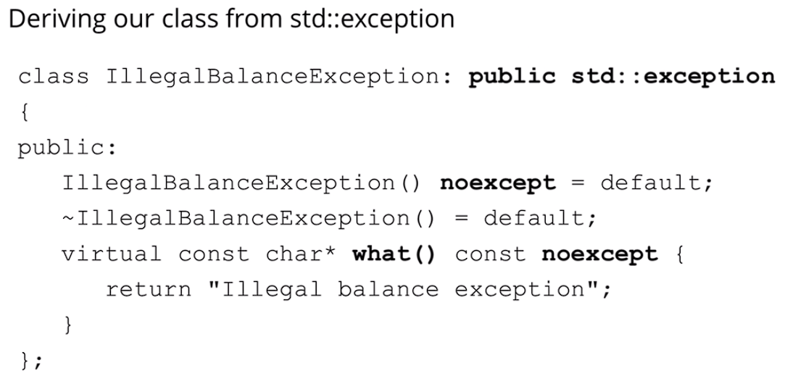

https://www.udemy.com/course/beginning-c-plus-plus-programming/learn/lecture/9934388#reviews

## Exception Handling
- ### Should be used only for synchronous code, not asynchronous
	- ### Asynchronous code involves operations that don't block the execution of the program, and exceptions might not propagate as expected
- ### What causes exceptions?
	- ### Insufficient resources
	- ### Missing resources
	- ### Invalid operations
	- ### Range violations
	- ### Underflows and overflows
	- ### Illegal data and many others

- ### Exception, Throwing, Catching

- ### `throw`, `try`, `catch`

- ### E.g.

 

## Throwing an exception from a function
- ### E.g. Below, if without a try-catch block, the program will terminate

 

## Handling multiple exceptions

- ### Also can use a 'Catch-all' handler

 

## Stack unwinding

 

## User defined exceptions

 

## Class level exceptions

 

## `std::exception` class hierarchy
- ### We can create subclasses of `std::exception` to create custom exception objects

- ### C++ 17 additions are in orange

- ### E.g.
	- ### `noexcept` tells the compiler to not throw an exception from a method/function

