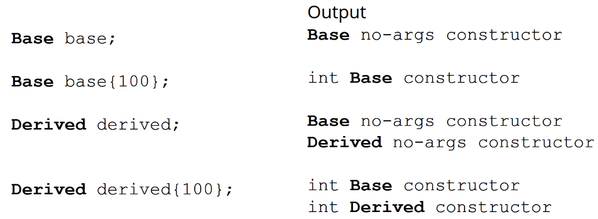

https://www.udemy.com/course/beginning-c-plus-plus-programming/learn/lecture/9535642#questions

## Inheritance

### **'is a'**, Generalization, Specialization, Inheritance

### e.g. A student **'is a'** person, but not an employee; administrator **'is a'** person and an employee

### When a child (derived) instance is created, it's parent class constructor executes before the child constructor

### When a child instance is destroyed, the child destructor executes before the parent destructor

 

## Inheritance vs Composition
### Consider using composition first, then inhieritance if it makes sense as inhertiance increase complexity

 

## Inheritance Syntax
### If an 'access specifier' is not defined, it is `private` by default

### How `public`, `private` and `protected` extensions affect class members

 

## Choosing the base class constructor to be called before the derived class constructor
### Base class no-args (default) constructor is called automatically if not specified after a derived constructor

### To initialize a derived object, it's constructor must ensure it's base class is also initialized (The base class may have private member variables, which cannot be accessed from the derived class). Invoke the base-class constructor in the initialization list of the derived constructor:

### e.g.

 

## Copy, Move Constructors and Overloaded operators with Inheritence

# TBC

 

## Override Methods
### Derived classes can override base class methods (must have same name and declaration)

 

## Static Binding
### Compiler determines which methods are called based on what it sees at compile time
### Static binding is the default in C++

 

## Dynamic Binding
### ...

 

## Multiple Inheritance
