https://www.udemy.com/course/beginning-c-plus-plus-programming/learn/lecture/27255950#overview

## Lambda Functions and Function Objects
- ### ***Function Objects*** = A Class that overloads the function call operator `()`
	- ### Can create an instance and call it like a function using `()`
- ### ***Lambda Functions*** = An anonymous Function Object
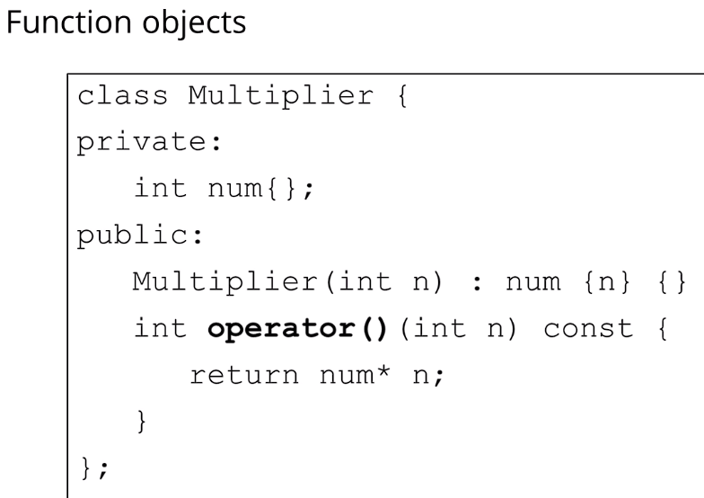
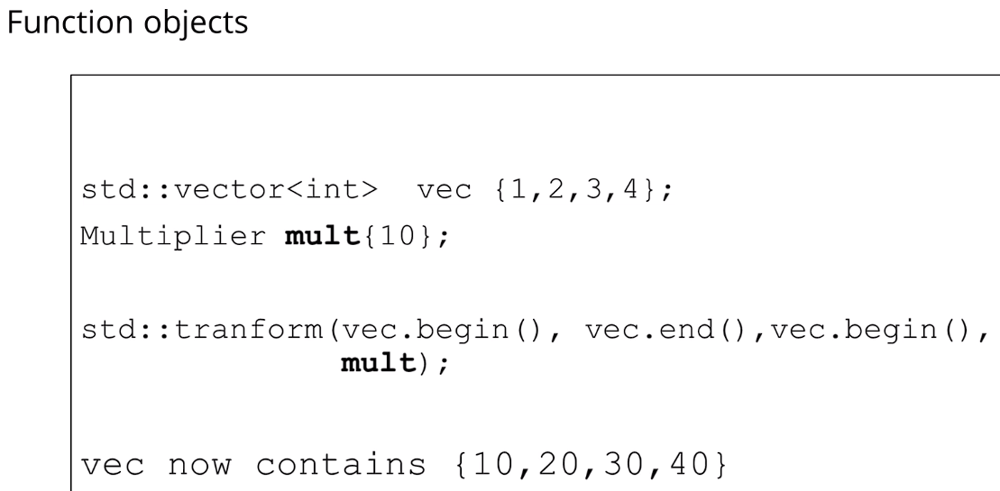
- ### Same as above
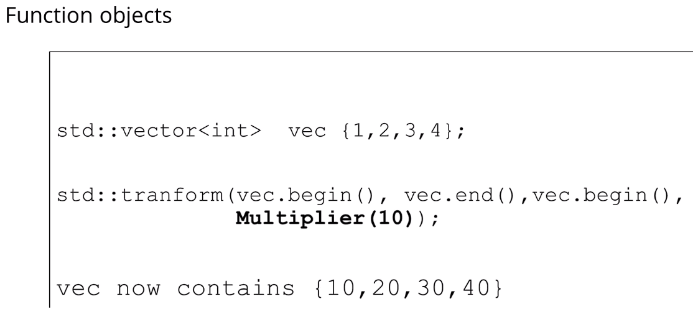

 

- ### E.g. Generic Function Object Class/Struct
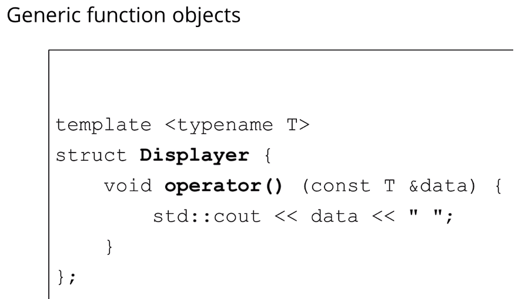
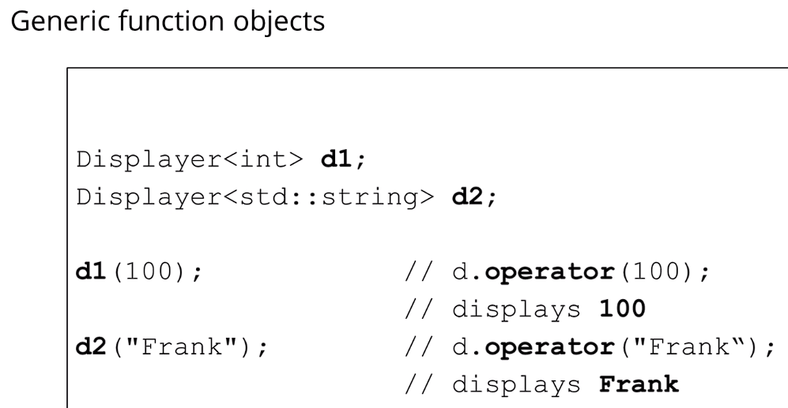
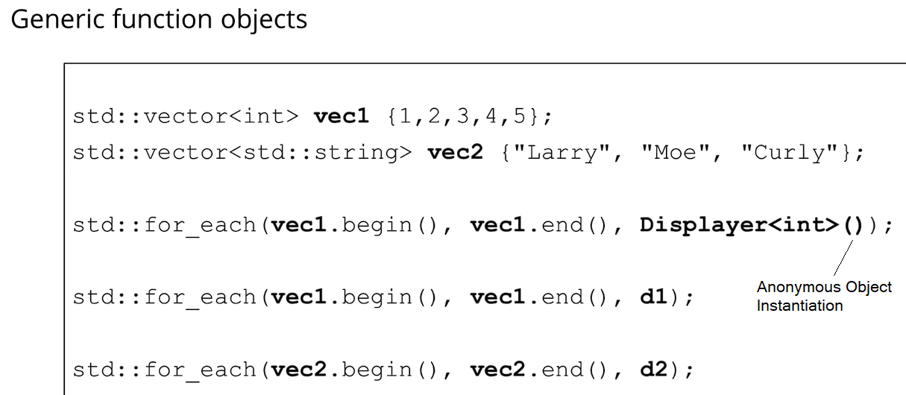

 

## Stateless Lambda Functions
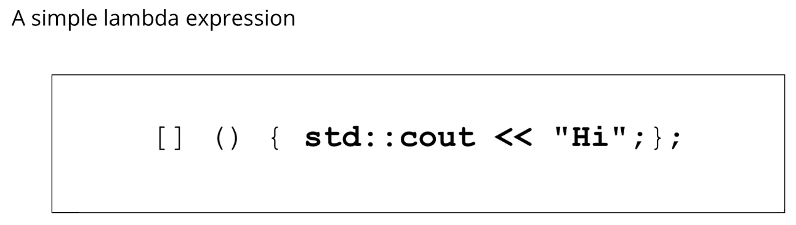
- ### Function call operator `()` instantiates a function object from the lambda expression
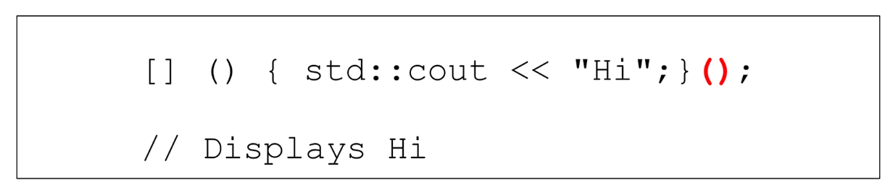

 

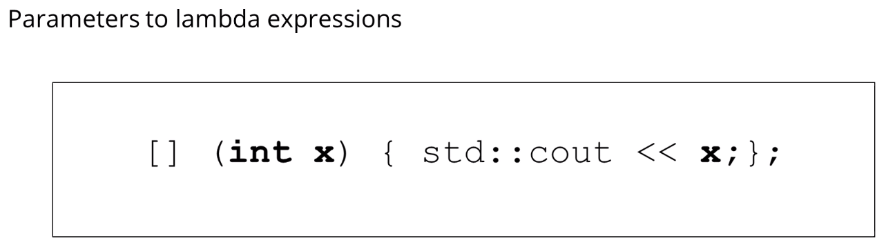

 

- ### Assign the lambda function to a variable, then use function call operator `()`
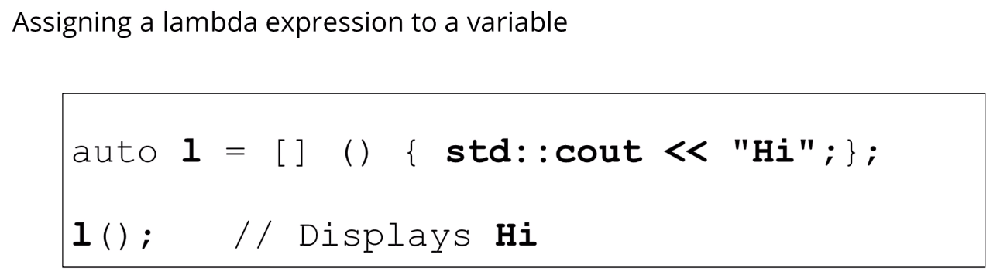
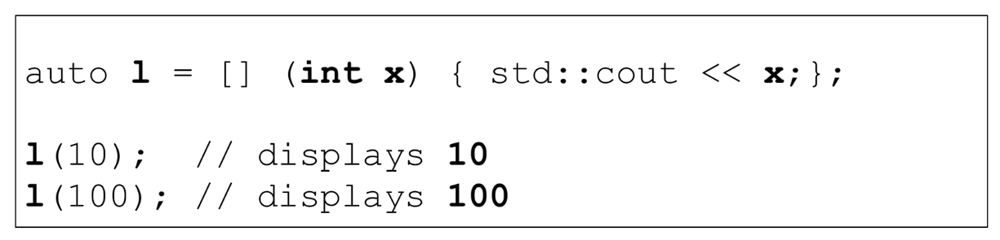

 

- ### Optional explicit type return
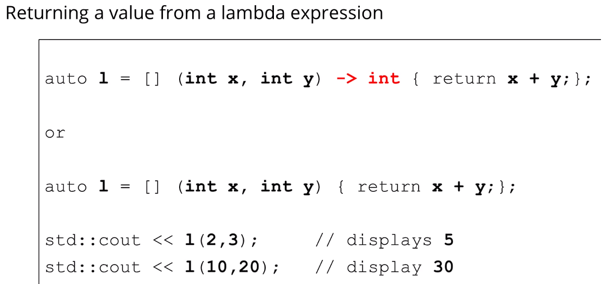

 

- ### E.g. Lambda as function parameters
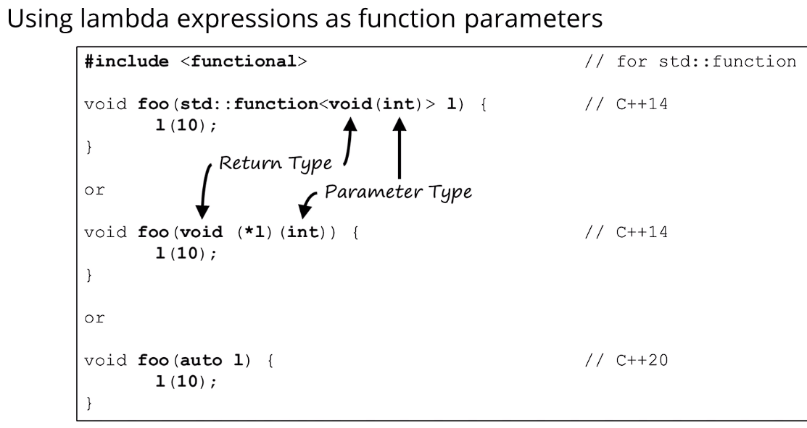

 

- ### E.g. Returning a lambda (3 ways)
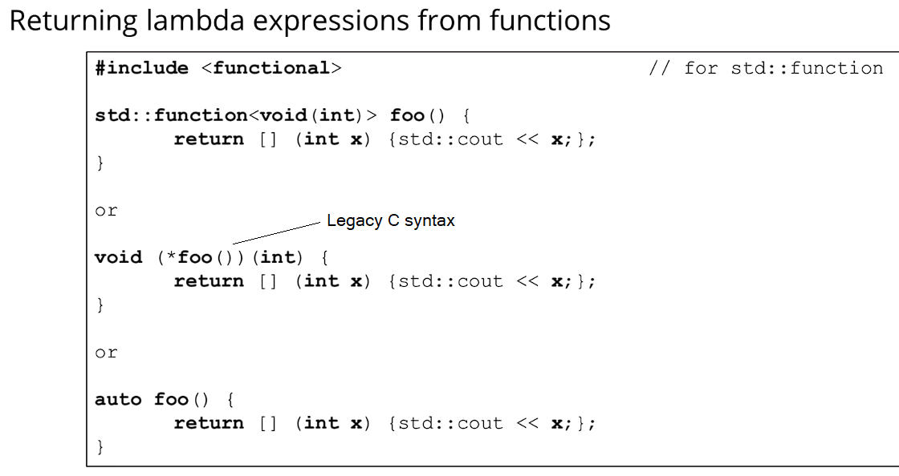

 

- ### E.g. Predicate Lambda
	- ### ***Predicate*** = A function that takes any number of arguments and returns a boolean value
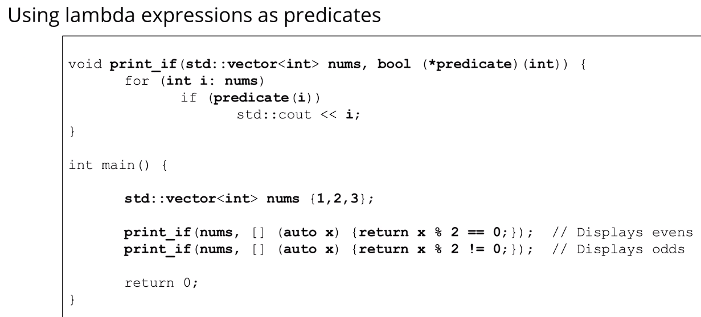

 

- ### E.g. More examples...
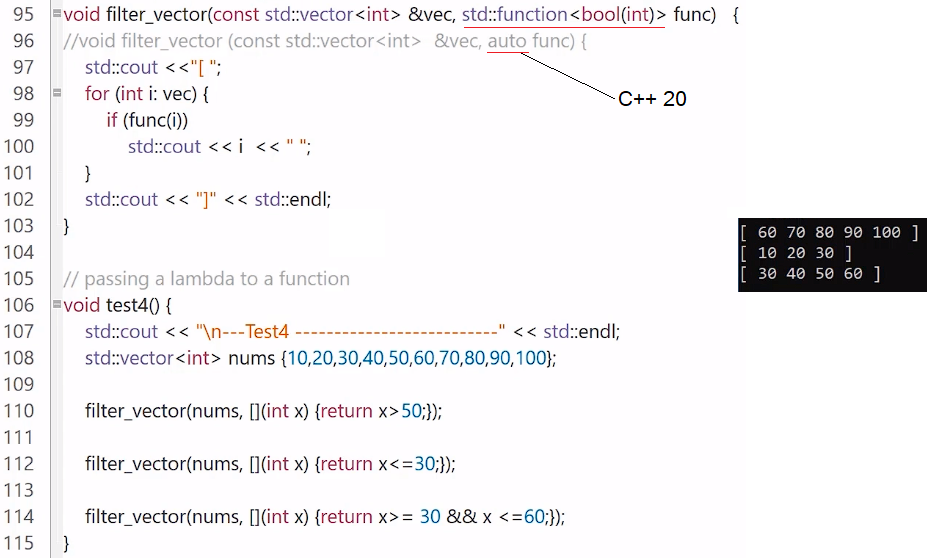

 

## Stateful Lambda Functions
- ### A lambda function with a non-empty ***Capture List***
- ### ***Closure*** = Any function, anonymous or not, that captures variables from the environment they are defined in
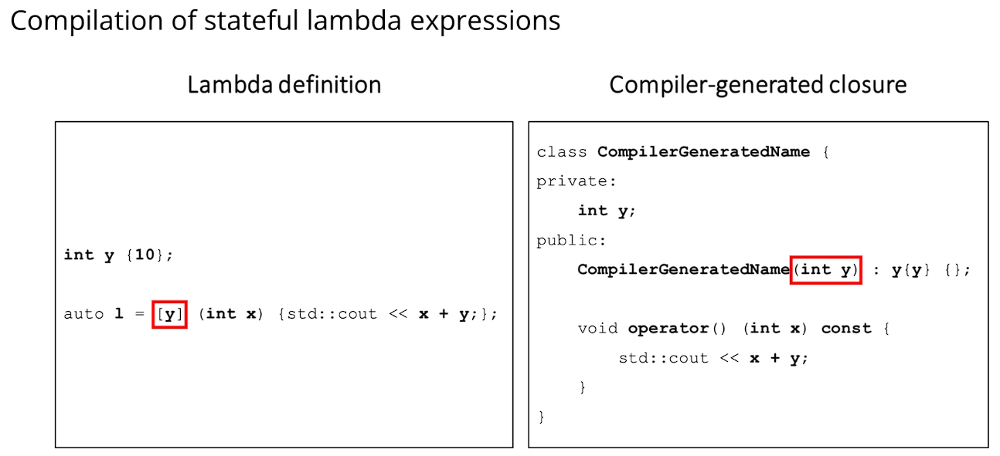

 

- ### Capture by value - Cannot modify the captured variable
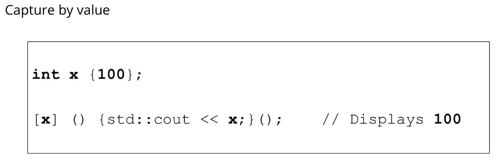

 

- ### `Mutable` - Can modify the captured variable; original is unchanged
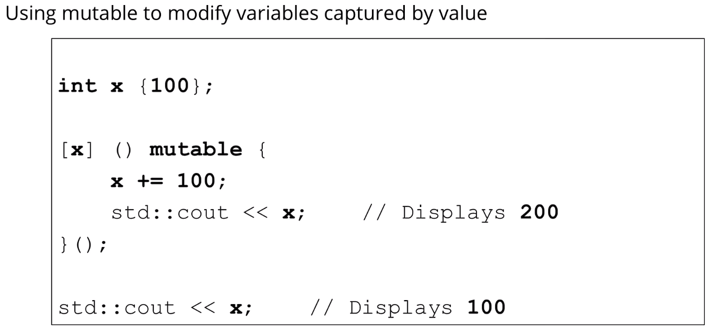

 

- ### Capture by reference - Can modify the captured variable; original is changed
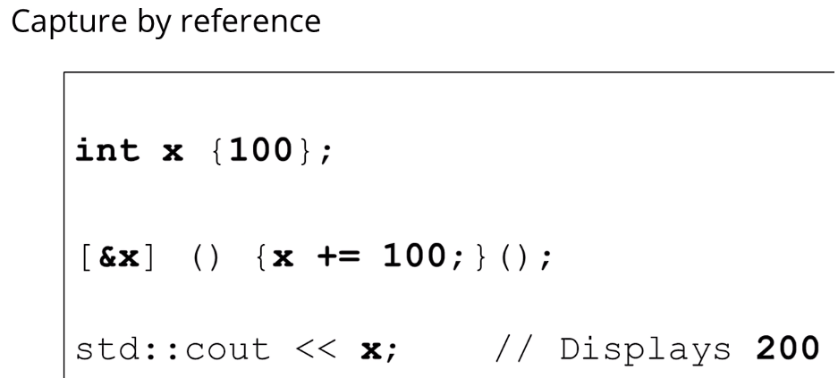

 

- ### Default captures - Applies to all variables in capture list; Must be first in the capture list
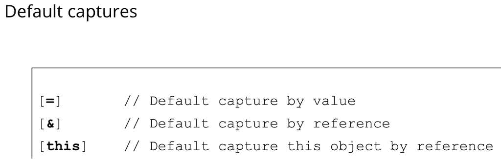
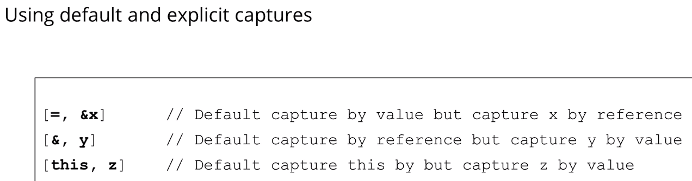

 

## Lambda Function with STL more examples
- ### `Unary Predicate` = Predicate function that takes one argument
- ### `Binary Predicate` = Predicate function that takes two arguments

 

- ### E.g.
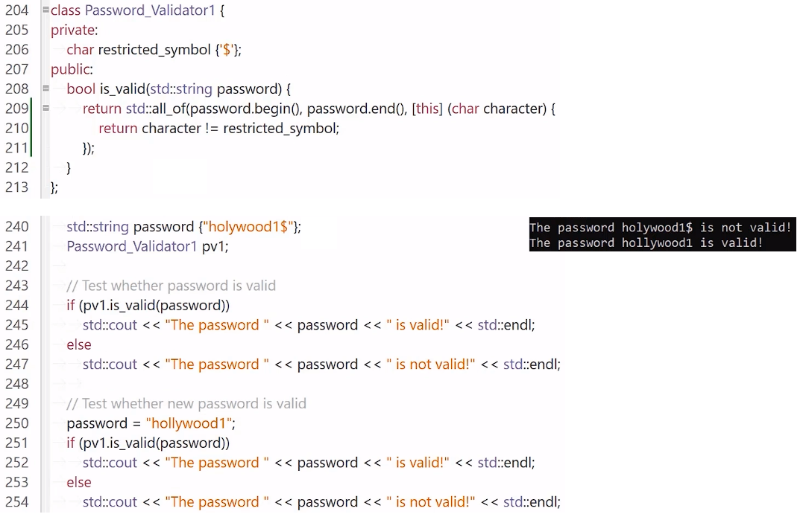

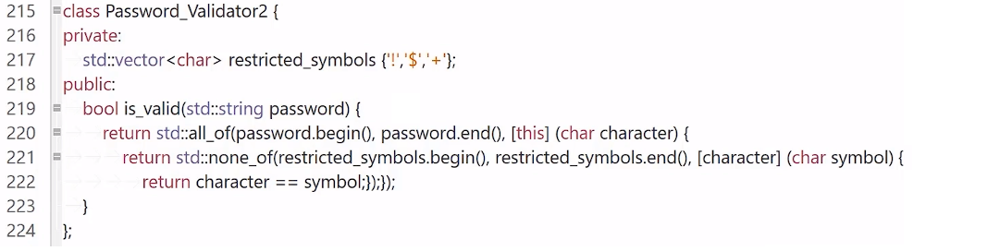