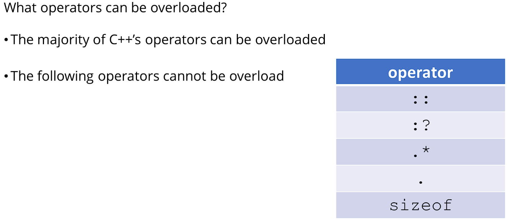
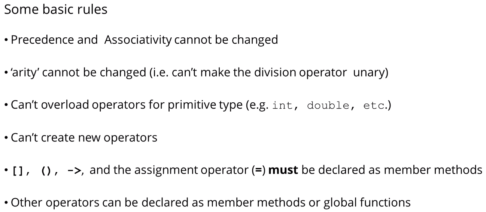
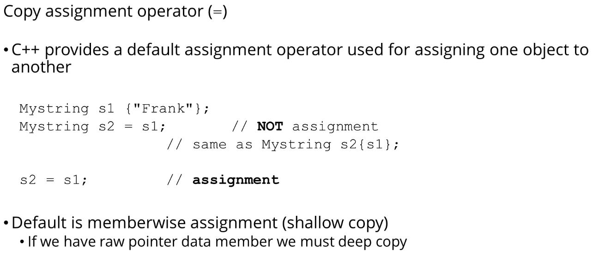
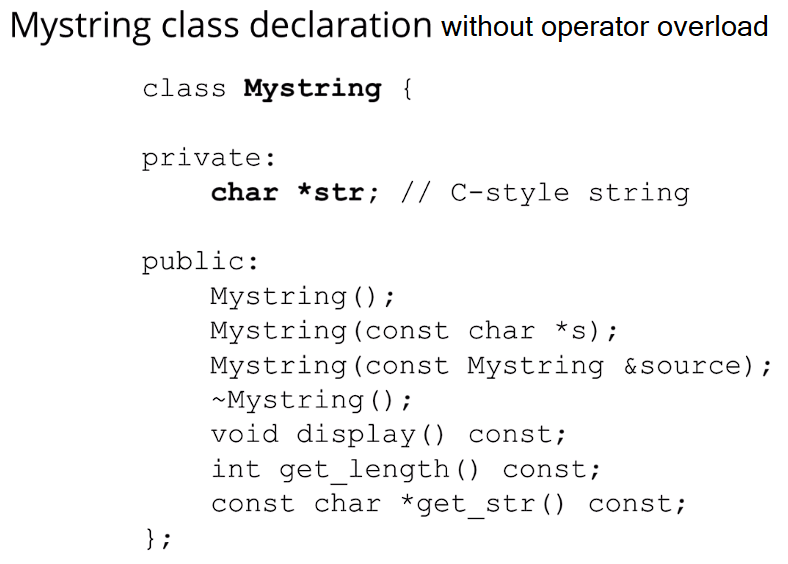
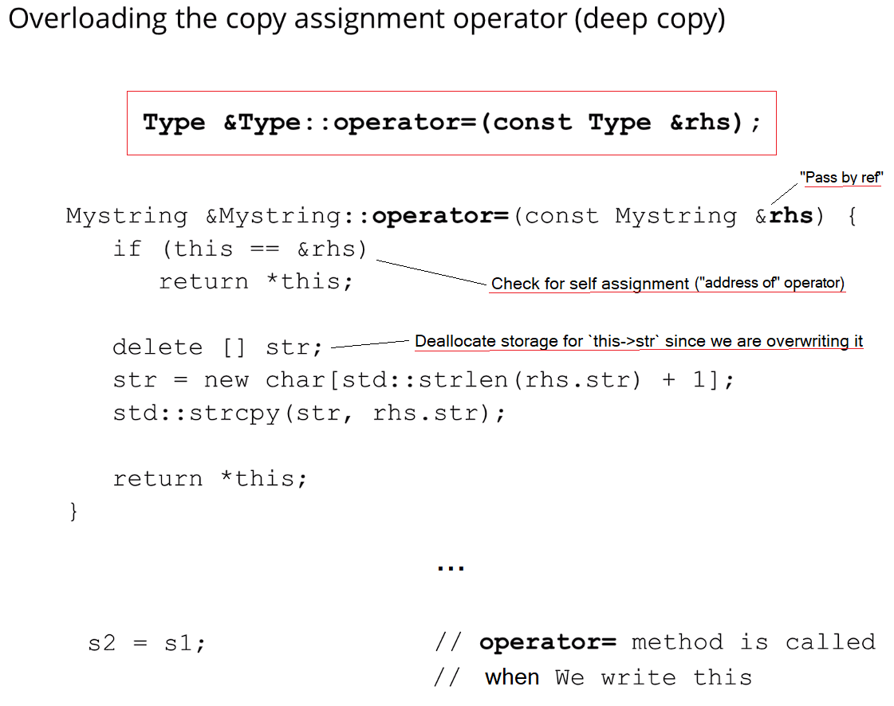

https://www.udemy.com/course/beginning-c-plus-plus-programming/learn/lecture/9535622#overview

 

- ## Overloading the assignment operator

- ### E.g.

- ### `this` keyword is a pointer to the current instance
- ### `*this` is the dereferenced value ie the current instance object
- ### We need to deallocate `str` since it's pointing to a string on the heap, otherwise we will have a memory leak
- ### Returning `*this` to allow chain assignment
	- ### E.g. `s1 = s2 = s3`
- ### Could also write `delete [] str;` as `delete [] this->str;`
