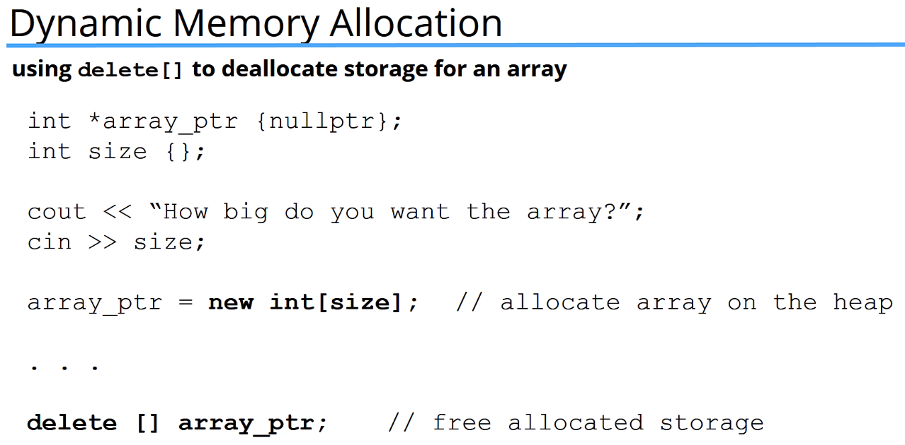
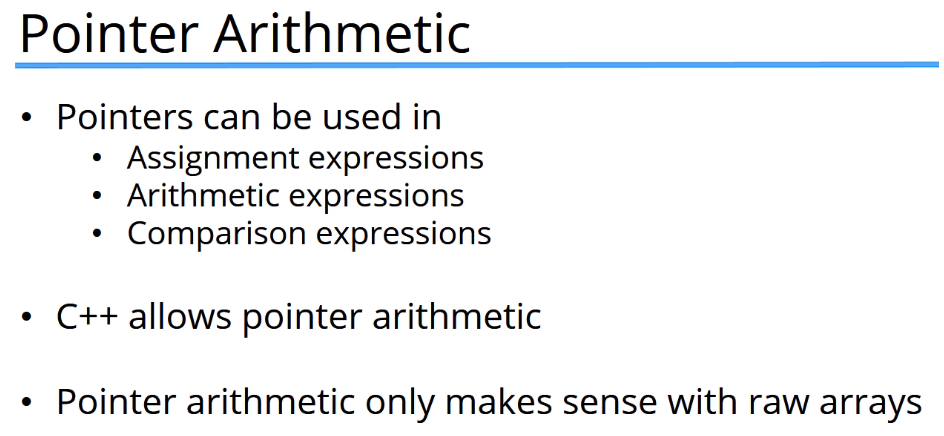

https://www.udemy.com/course/beginning-c-plus-plus-programming/learn/lecture/9535526#questions

## Pointers
### A variable that stores a memory address as its value


### If you don't initialize a pointer, it will point to a random memory location

### e.g.
```
// Equivalent

int *myPtr;
char* myPtr2;
```

<br>

### e.g.
```
// Initializing pointer variables to 'no-where' (address 0)

int *myPtr {};
string *myPtr2 {nullptr};
```

<br>


<br>

## Dereferencing Pointers
### Get the value of the address a pointer is pointing to and can modify it by reassigning
### (B) !!! **Pointer** and **Dereferenced Pointer** are different but share the same operator `*`. Pointer is during variable declaration


<br>

## Pointers to Constants
### Memory address value can be modified, but not the Dereferenced value


<br>

## Constant Pointers
### Dereferenced value can be modified, but not the Memory address value


<br>

## Constant Pointers to Constants
### Neither the Dereferenced value or Memory address value can be modified


<br>

## Dynamic Memory Allocation


### Use `new` to allocate memory (on the heap) at runtime


### When finished using the memory, must deallocate using `delete`, making the memory available to use again


### Allocating and deallocating memory for an array



<br>

## Pointer Arithmetic





### Below - Both return the same output


<br>

## Pass by Reference with Pointers or Memory Addresses
### In order to pass-by-reference with a pointer, the function must expect a pointer as a parameter and we must pass in an address of some variable that is of the same type

### So instead of creating a pointer then passing that pointer into the function, we can also "create" a pointer by passing an address as the argument

### When using pass-by-reference with (&) in the parameter, we do **NOT** need to explicitly take the address of the variable when we call the function. The compiler will automatically do that for us. However, when we have a pointer in the parameter, then we **MUST** explicitly pass in the address ourselves

### In C++ passing a pointer by reference is not often seen. This is sometimes done when the programmer wants to change the pointer being passed in, not just the data the pointer points to


<br>

## Return a Pointer (return a memory address)


<br>

## Return dynamically allocated memory


<br>

## When to use Pointer vs Reference parameters

| Parameter | Function Modifies the Parameter? | Parameter can be `nullptr`? | Notes |
| :-: | :-: | :-: | :-: |
| Pass By Value (Default) | Y | N | Parameter size is small; arbitrary performance loss if copied |
| Pass By Reference using a Pointer | Y | Y | Parameter is expensive to copy |
| Pass By Reference using a Pointer to `const` | N | Y | Parameter is expensive to copy |
| Pass By Reference using a `const` Pointer to `const` | N | Y | <ul><li>Parameter is expensive to copy</li><li>Don't need to modify the Pointer</li></ul> |
| Pass By Reference using a Reference | Y | N | Parameter is expensive to copy |
| Pass By Reference using a `const` Reference | N | N | Parameter is expensive to copy |