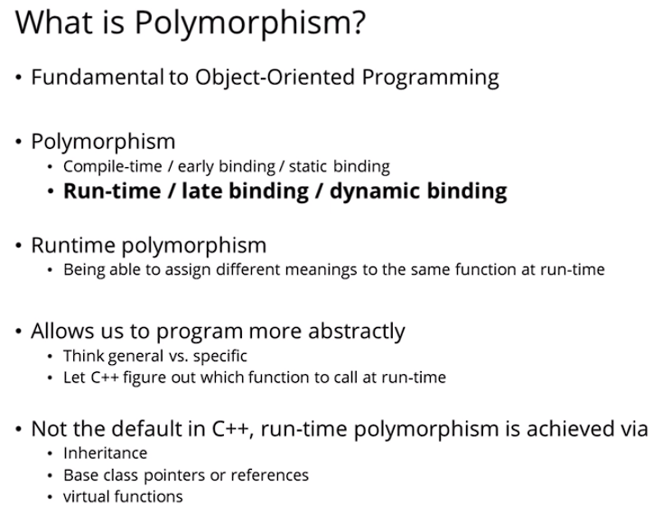
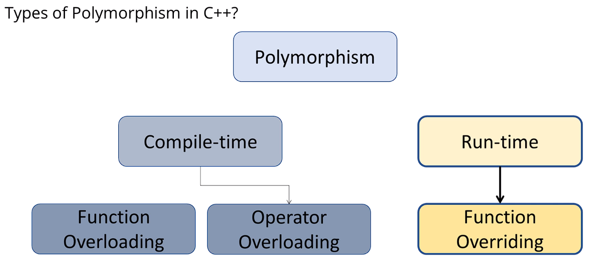
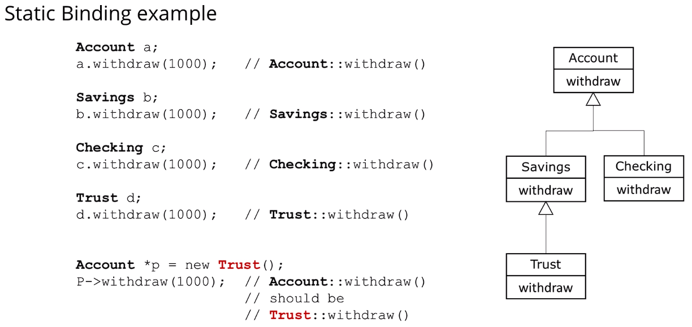
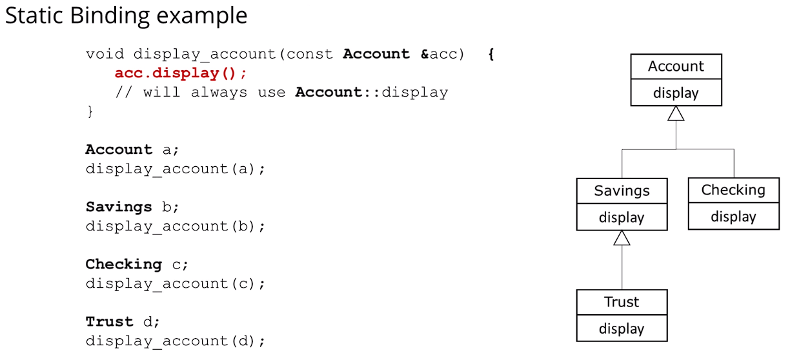
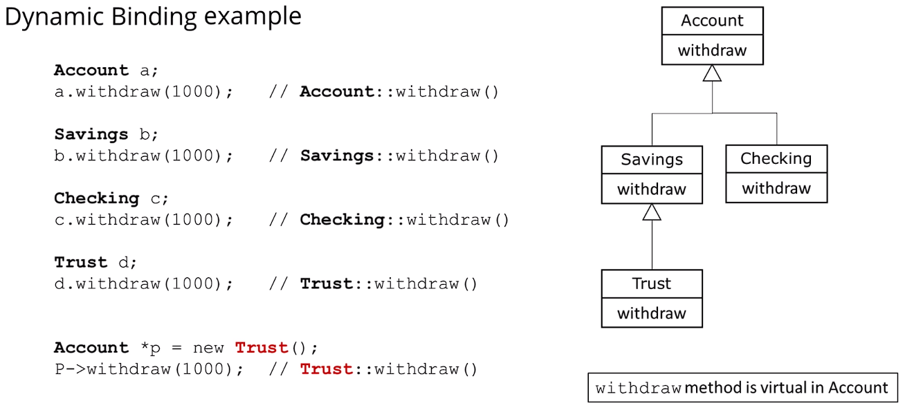

## What is Polymorphism?

### C++ uses static binding by default
- ### "Compile time/static binding" = before the program executes
- ### "Run time/dynamic binding" = while the program executes

 

