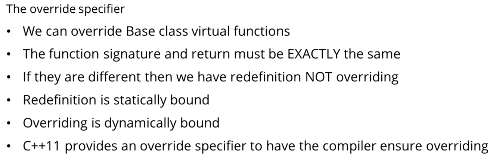

## What is Polymorphism?

### C++ uses static binding by default
- ### "Compile time/static binding" = before the program executes
- ### "Run time/dynamic binding" = while the program executes

 

 

### Dynamic Binding example - Using Base (Top-most Parent) Class pointers

 

## Virtual functions
- ### Enables drived classes methods to be dynamically bound
- ### When virtual functions are overridden in derived classes, it will be bound dynamically at runtime if we use a base class pointer or reference

### Example:

 

## Virtual destructors

 

## Override specifier

### e.g. Not actually overriding

### e.g. Actually overriding

 

## Final specifier
### When used at the class level: Prevents a class from being derived from

### When used at the method level: Prevents a virtual method from being overridden in derived classes

### - e.g. `My_class` cannot be derived from, and `Dervied` cannot be derived from

### - e.g. class `C` method `do_something()`, cannot override `do_something()` from class `B`

 

## Base class references
### We can also use base class references with dynamic polymorphism

### Useful if we pass objects to functions that expect a base class reference

### e.g. Where `Account` is the base class; `Trust` is a derived class

### e.g. The correct `withdraw()` virtual method will be called at runtime based on the first argument passed in: `&account` which is either a `Account` or `Trust` reference
