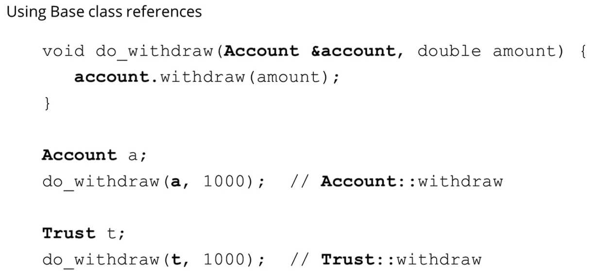

https://www.udemy.com/course/beginning-c-plus-plus-programming/learn/lecture/9535686#questions

## What is Polymorphism?

### C++ uses static binding by default
- ### "Compile time/static binding" = before the program executes
- ### "Run time/dynamic binding" = while the program executes

 

 

### Dynamic Binding example - Using Base (Top-most Parent) Class pointers

 

## Virtual functions (actually should be 'methods')
- ### Enables drived classes methods to be dynamically bound
- ### When virtual functions are overridden in derived classes, it will be bound dynamically at runtime if we use a base class pointer or reference
- ### Can only override base class virtual functions, within a derived class

- ### e.g.

 

## Virtual destructors

 

## Override specifier
- ### Best practice to explicitly state when overriding a virtual function, but not required. They are required if we want to override a ***pure virtual function*** from an abstract class

- ### It helps catch errors where the signature of the overriding function doesn't match the signature of the overridden function in the base class

- ### e.g. Not actually overriding

- ### e.g. Actually overriding

 

## Final specifier
- ### When used at the class level: Prevents a class from being derived from

- ### When used at the method level: Prevents a virtual method from being overridden in derived classes

- ### e.g. `My_class` cannot be derived from, and `Dervied` cannot be derived from

- ### e.g. class `C` method `do_something()`, cannot override `do_something()` from class `B`

 

## Base class references
- ### We can also use base class references with dynamic polymorphism

- ### Useful if we pass objects to functions that expect a base class reference

- ### e.g. Where `Account` is the base class; `Trust` is a derived class

- ### e.g. The correct `withdraw()` virtual method will be called at runtime based on the first argument passed in: `&account` which is either a `Account` or `Trust` reference

 

## Pure virtual functions and abstract classes

- ### What is an abstract class and concrete (Regular) class?

- ### An Abstract class must contain atleast one pure virtual function

 

- ### e.g. Wouldn't need to create instances of the abstract `Shape`, `Open_Shape`, `Closed_Shape` class, but can create instances of `Line`, `Circle` and `Square` concrete classes

- ### Assuming `draw()` and `rotate()` are pure virtual functions in `Shape` class, concrete classes `Line`, `Circle` and `Square` must override them, otherwise they will also be abstract classes

### Conclusion

 

